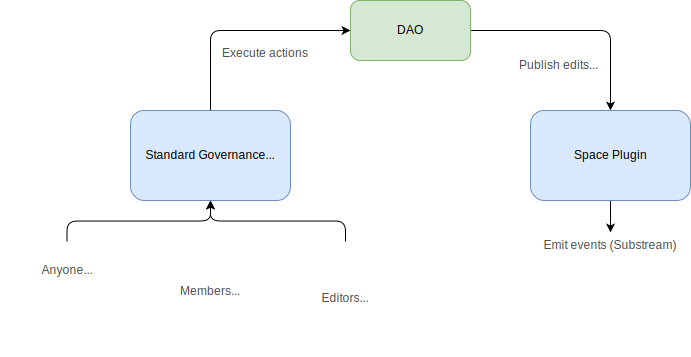
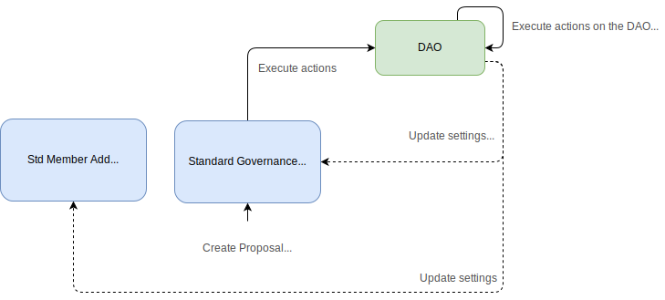
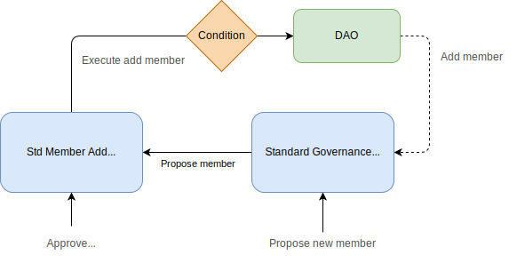
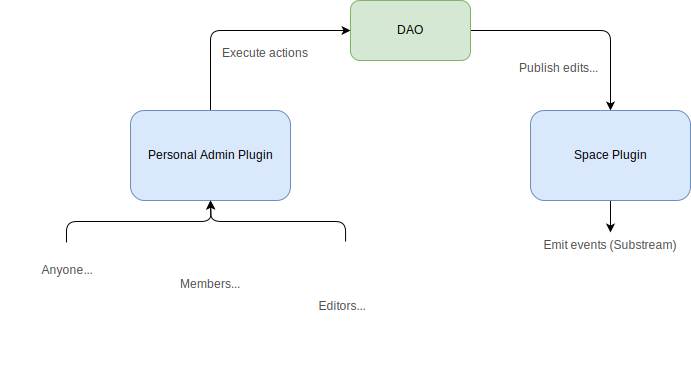
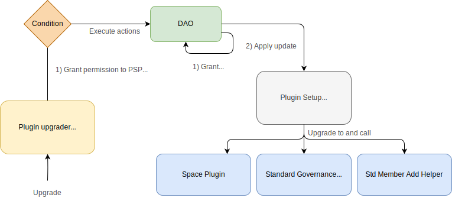
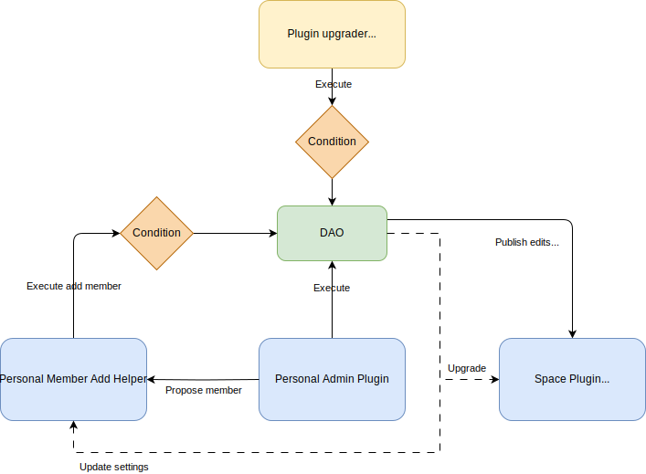

# Geo Browser - Aragon OSx

The following project contains the plugin smart contracts providing the foundation of the Geo Browser project. See `packages/contracts` and `packages/contracts-ethers`.

## Getting started

```
cp .env.template .env
```

Add your Infura API key and then, run:

```
yarn
cd packages/contracts
yarn build
yarn test
```

See the [deployment checklist](./README_DEPLOYMENT.md)

## Overview

A Space is composed by a DAO and several plugins installed on it. The [DAO](https://github.com/aragon/osx/blob/develop/packages/contracts/src/core/dao/DAO.sol) contract holds all the assets and rights to act on external components, while plugins are custom, composable, opt-in pieces of logic that can perform certain actions governed by the DAO's permission database.

The DAO contract can be deployed by using Aragon's DAOFactory contract. This will deploy a new DAO with the desired plugins and their respective settings.

The current repository provides the plugins necessary to cover two use cases:

1. A standard space where members propose changes and editors vote on them
   - Space plugin
   - Member Access plugin
   - Main Voting plugin
2. A personal space, where editors apply changes immediately
   - Space plugin
   - Personal Space Admin plugin

### Standard Space

In standard spaces, _members_ can create proposals while _editors_ can vote on them. Approved proposals can be executed by anyone and this will make the DAO call the predefined proposal actions.

The most typical case will be telling the Space Plugin to emit the event of a proposal being processed. It can include emitting a new hash for the contents or accepting a subspace.



The Main Voting Plugin can also pass proposals that change its own settings.



To manage who can create proposals, the Member Access Plugin allows anyone to request becoming a member. Editors can approve or reject incoming proposals.



### Personal Space

Personal spaces are a simplified version, where anyone defined as editor can immediatelly execute proposals. Typically to edit the contents of a space.



Editors may also execute proposals who define new editors.


### Plugin Upgrader

There's an optional feature, where a predefined address can execute the actions to upgrade a plugin to the latest published version.



## Global lifecycle

### Space genesis

1. When the `MainVotingPlugin` is installed, an initial editor is defined

### Joining a space

1. Someone calls `proposeAddMember()` on the `MainVotingPlugin`
   - If the caller is the only editor, the proposal succeeds immediately
   - The proposal is created on the `MemberAccessPlugin` because the governance rules differ from the rest of proposals
2. One of the editors calls `approve()` or `reject()`
   - Calling `approve()` makes the proposal succeed
   - Calling `reject()` cancels the proposal
3. A succeeded proposal is executed automatically
   - This makes the DAO call `addMember()` on the main voting plugin

### Creating proposals for a space

1. An editor or a member creates a proposal
2. Editors can vote on it for a predefined amount of time
3. If the proposal exceeds the required quorum and support, the proposal succeeds
4. Succeeded proposals can be executed by anyone

### Emitting content and managing subspaces

1. When a proposal regarding the space is passed, the `MainVotingPlugin` will call `execute()` on the DAO
2. The actions from the proposal will target the `publishEdits()`, `acceptSubspace()` or `removeSubspace()` functions on the `SpacePlugin`.
3. The `SpacePlugin` will be called by the DAO and emit the corresponding events
4. An external indexer will fetch all these events and update the current state of this specific space

## General notice

The implementation of the four plugins is built on top of existing and thoroughly autited plugins from Aragon OSx. In order to fully accomodate to Geo's design, some functions and interfaces needed a few tweaks, which made it necessary to fork and adapt these contracts in-place.

They can be found on `packages/contracts/src/governance/base`

[Learn more about Aragon OSx](https://devs.aragon.org/docs/osx/how-it-works/framework/)

## How permissions work

Each Space created is an Aragon DAO. It holds any assets and most importantly, it manages the permission database that governs all plugin interactions.

A permission looks like:

- An address `who` holds `MY_PERMISSION_ID` on a target contract `where`

New DAO's deployed manyally will grant `ROOT_PERMISSION` to its creator. However, most DAO's are typically deployed via Aragon's DAO factory, which will deploy a new contract with safe defaults, install all the requested plugins and drop the ROOT permission when the set up is done.

Managing permissions is made via two functions that are called on the DAO:

```solidity
function grant(address _where, address _who, bytes32 _permissionId);

function revoke(address _where, address _who, bytes32 _permissionId);
```

### Permission Conditions

For the cases where an unrestricted permission is not derisable, a [Permission Condition](https://devs.aragon.org/docs/osx/how-it-works/core/permissions/conditions) can be used.

Conditional permissions look like this:

- An address `who` holds `MY_PERMISSION_ID` on a target contract `where`, only `when` the condition contract approves it

Conditional permissions are granted like this:

```solidity
function grantWithCondition(
  address _where,
  address _who,
  bytes32 _permissionId,
  IPermissionCondition _condition
);
```

See the `MemberAccessExecuteCondition` contract. It restricts what the [MemberAccessPlugin](#member-access-plugin) can execute on the DAO.

[Learn more about OSx permissions](https://devs.aragon.org/docs/osx/how-it-works/core/permissions/)

### Permissions being used

For standard governance spaces:


For personal spaces:


Below are all the permissions that a [PluginSetup](#plugin-setup-contracts) contract may want to request:

Proposal:

- `EDITOR_PERMISSION` is required to execute proposals on the [PersonalSpaceAdminPlugin](#personal-space-admin-plugin)
- `EXECUTE_PERMISSION` is required to make the DAO `execute` a set of actions
  - Only plugins should have this permission
  - Some plugins should restrict it with a condition

Spaces:

- `CONTENT_PERMISSION_ID` is required to call the function that emits new content events on the [SpacePlugin](#space-plugin)
  - Typically called by the DAO via proposal
- `SUBSPACE_PERMISSION_ID` is required to call the functions that emit new subspace accept/reject events on the [SpacePlugin](#space-plugin)
  - Typically called by the DAO via proposal

Governance settings:

- `UPDATE_VOTING_SETTINGS_PERMISSION_ID` is required to change the settings of the [MainVotingPlugin](#main-voting-plugin)
- `UPDATE_ADDRESSES_PERMISSION_ID` is required to add or remove members or editors on the [MainVotingPlugin](#main-voting-plugin)
  - Typically called by the DAO via proposal
- `UPDATE_MULTISIG_SETTINGS_PERMISSION_ID` is required to change the settings of the [MemberAccessPlugin](#member-access-plugin)
  - Typically called by the DAO via proposal

Permission management:

- `ROOT_PERMISSION` is required to make the DAO `grant` or `revoke` permissions
  - If the DAO is executing a set of actions, it needs to be ROOT on itself (it is by default)
  - The PluginSetupProcessor may be granted ROOT permission temporarily
  - Nobody else should be ROOT on a DAO

Plugin versioning:

- `UPGRADE_PLUGIN_PERMISSION` is required to be able to call `upgradeTo()` or `upgradeToAndCall()` on a plugin
  - Called by the PSP via proposal on the DAO
- `APPLY_UPDATE_PERMISSION` is needed to call `applyUpdate()` on the PluginSetupProcessor
  - Optionally granted to an additional address, for convenience
  - Correspondingly, `APPLY_INSTALLATION_PERMISSION` and `APPLY_UNINSTALLATION_PERMISSION` allow to call `applyInstallation()` or `applyUninstallation()`

Other DAO permissions:

- `EXECUTE_PERMISSION`
- `UPGRADE_DAO_PERMISSION`
- `SET_METADATA_PERMISSION`
- `SET_TRUSTED_FORWARDER_PERMISSION`
- `SET_SIGNATURE_VALIDATOR_PERMISSION`
- `REGISTER_STANDARD_CALLBACK_PERMISSION`

## Interacting with the contracts from JS

Run `yarn build && yarn typechain` on the `packages/contracts` folder.

See `packages/contracts/typechain` for all the generated JS/TS wrappers to interact with the contracts.

[Learn more](https://github.com/dethcrypto/TypeChain)

## Encoding and decoding actions

Making calls to the DAO is straightforward, however executing arbitrary actions requires them to be encoded, stored on chain and be approved before they can be executed.

To this end, the DAO has a struct called `Action { to, value, data }`, which will make the DAO call the `to` address, with `value` ether and call the given calldata (if any).

It uses the generated typechain artifacts, which contain the interfaces for the available contract methods and allow to easily encode function calls into hex strings.

## Adding members and editors

On Spaces with the standard governance, a [MemberAccessPlugin](#member-access-plugin) and a [MainVotingPlugin](#main-voting-plugin) will be installed.

### Members

- Send a transaction to call `proposeNewMember()`
- Have an editor (different to the proposer) calling `approve()` for this proposal
- This will add the requested address to the members list on the main voting contract

The same applies to remove members with `proposeRemoveMember()`

### Editors

- A member or editor creates a proposal
- The proposal should have an action to make the DAO `execute()` a call to `addEditor()` on the plugin
- A majority of editors call `vote()` and approve it
- Someone calls `plugin.execute()` so that the DAO executes the requested action on the plugin
- The new editor will be able to vote on proposals created from then on

The same procedure applies to removing editors with `removeEditor()`

## Adding editors (personal spaces)

- Execute a proposal with an action to call `grant(address(mainVotingPlugin), targetAddress, EDITOR_PERMISSION_ID)`
- With the permission granted, `targetAddress` can immediately start executing proposals

The same applies for removing a member.

## The DAO's plugins

### Space plugin

Acts as the source of truth regarding the Space associated to the DAO. It is in charge of emitting the events that notify new content being approved and it also emits events accepting a certain DAO as a Subpspace.

The same plugin is used for both governance cases. The difference lies on the governance model.

This plugin is upgradeable.

#### Methods

```solidity
function initialize(IDAO _dao, string _firstContentUri, address predecessorSpace);

function publishEdits(string _contentUri);

function acceptSubspace(address _subspaceDao);

function removeSubspace(address _subspaceDao);
```

Inherited:

```solidity
function upgradeTo(address newImplementation);

function upgradeToAndCall(address newImplementation, bytes data);
```

#### Getters

Inherited:

```solidity
function implementation() returns (address);
```

#### Events

```solidity
event EditsPublished(address dao, string contentUri);
event SuccessorSpaceCreated(address dao, address predecessorSpaceDao);
event SubspaceAccepted(address dao, address subspaceDao);
event SubspaceRemoved(address dao, address subspaceDao);
```

#### Permissions

- The DAO can call `publishEdits()` on the plugin
- The DAO can accept/remove a subspace on the plugin
- The DAO can upgrade the plugin
- See [Plugin upgrader](#plugin-upgrader) (optional)

### Member Access plugin

Provides a simple way for any address to request membership on a space. It is a adapted version of Aragon's [Multisig plugin](https://github.com/aragon/osx/blob/develop/packages/contracts/src/plugins/governance/multisig/Multisig.sol). It creates a proposal to `addMember()` on the main voting plugin and Editors can approve or reject it. Once approved, the member create proposals on the main voting plugin.

#### Methods

```solidity
function initialize(IDAO _dao, MultisigSettings _multisigSettings);

function updateMultisigSettings(MultisigSettings _multisigSettings);

function proposeNewMember(bytes _metadata, address _proposedMember);

function proposeRemoveMember(bytes _metadata, address _proposedMember);

function approve(uint256 _proposalId);

function reject(uint256 _proposalId);

function execute(uint256 _proposalId);
```

Inherited:

```solidity
function upgradeTo(address newImplementation);

function upgradeToAndCall(address newImplementation, bytes data);
```

#### Getters

```solidity
function supportsInterface(bytes4 _interfaceId) returns (bool);

function canApprove(uint256 _proposalId, address _account) returns (bool);

function canExecute(uint256 _proposalId) returns (bool);

function getProposal(
  uint256 _proposalId
)
  returns (
    bool executed,
    uint16 approvals,
    ProposalParameters parameters,
    IDAO.Action[] actions,
    uint256 failsafeActionMap
  );

function hasApproved(uint256 _proposalId, address _account) returns (bool);

function isMember(address _account) returns (bool);

function isEditor(address _account) returns (bool);
```

Inherited:

```solidity
function proposalCount() external view returns (uint256);

function implementation() returns (address);
```

#### Events

```solidity
event Approved(uint256 indexed proposalId, address indexed editor);

event Rejected(uint256 indexed proposalId, address indexed editor);

event MultisigSettingsUpdated(uint64 proposalDuration, address mainVotingPlugin);
```

Inherited:

```solidity
event ProposalCreated(uint256 indexed proposalId, address indexed creator, uint64 startDate, uint64 endDate, bytes metadata, IDAO.Action[] actions, uint256 allowFailureMap);

event ProposalExecuted(uint256 indexed proposalId);
```

#### Permissions

- Anyone can create membership proposals
- Editors can approve and reject proposals
- The plugin can execute on the DAO (with a condition)
- The DAO can update the plugin settings
- The DAO can upgrade the plugin
- See [Plugin upgrader](#plugin-upgrader) (optional)

### Main Voting plugin

It's the main governance plugin for standard spaces, where all proposals are voted by editors. It is a adapted version of Aragon's [AddresslistVoting plugin](https://github.com/aragon/osx/blob/develop/packages/contracts/src/plugins/governance/majority-voting/addresslist/AddresslistVoting.sol). Only members (or editors) can create proposals and they can only be executed after a qualified majority has voted for it.

It acts as the source of truth about who is an editor, on Spaces with standard governance.

The governance settings need to be defined when the plugin is deployed but the DAO can change them at any time. Proposal creators can cancel their own proposals before they end.

#### Methods

```solidity
function initialize(
  IDAO _dao,
  VotingSettings calldata _votingSettings,
  address[] calldata _initialEditors
);

function addEditor(address);

function removeEditor(address);

function addMember(address);

function removeMember(address);

function createProposal(
  bytes calldata metadata,
  IDAO.Action[] calldata actions,
  uint256 allowFailureMap,
  VoteOption voteOption,
  bool tryEarlyExecution
);

function cancelProposal(uint256 _proposalId);
```

Inherited:

```solidity
function vote(uint256 _proposalId, VoteOption _voteOption, bool _tryEarlyExecution);

function execute(uint256 _proposalId);

function updateVotingSettings(VotingSettings calldata _votingSettings);

function upgradeTo(address newImplementation);

function upgradeToAndCall(address newImplementation, bytes data);
```

#### Getters

```solidity
function isMember(address _account) returns (bool);

function isEditor(address _account) returns (bool);

function supportsInterface(bytes4 _interfaceId) returns (bool);
```

Inherited:

```solidity
function canVote(uint256 _proposalId, address _voter, VoteOption _voteOption);

function getProposal(
  uint256 _proposalId
)
  returns (
    bool open,
    bool executed,
    ProposalParameters parameters,
    Tally tally,
    IDAO.Action[] actions,
    uint256 allowFailureMap
  );

function getVoteOption(uint256 _proposalId, address _voter);

function isSupportThresholdReached(uint256 _proposalId) returns (bool);

function isSupportThresholdReachedEarly(uint256 _proposalId);

function isMinParticipationReached(uint256 _proposalId) returns (bool);

function canExecute(uint256 _proposalId) returns (bool);

function supportThreshold() returns (uint32);

function minParticipation() returns (uint32);

function duration() returns (uint64);

function votingMode() returns (VotingMode);

function totalVotingPower(uint256 _blockNumber) returns (uint256);

function implementation() returns (address);
```

#### Events

```solidity
event ProposalCanceled(uint256 proposalId);
```

Inherited:

```solidity
event ProposalCreated(uint256 indexed proposalId, address indexed creator, uint64 startDate, uint64 endDate, bytes metadata, IDAO.Action[] actions, uint256 allowFailureMap);

event VoteCast(uint256 indexed proposalId, address indexed voter, VoteOption voteOption, uint256 votingPower);

event ProposalExecuted(uint256 indexed proposalId);

event VotingSettingsUpdated(VotingMode votingMode, uint32 supportThreshold, uint32 minParticipation, uint64 duration);
```

#### Permissions

- Members (and editors) can create proposals
- Editors can vote on proposals
- The plugin can execute on the DAO
- The DAO can update the plugin settings
- The DAO can manage the list of addresses
- The DAO can upgrade the plugin
- See [Plugin upgrader](#plugin-upgrader) (optional)

### Personal Space Admin Plugin

Governance plugin providing the default implementation for personal spaces, where addresses with editor permissioin can apply proposals right away. It is a adapted version of Aragon's [Admin plugin](https://github.com/aragon/osx/blob/develop/packages/contracts/src/plugins/governance/admin/Admin.sol).

Since this plugin has the power to unilaterally perform actions, it is not upgradeable. Adding many editors is possible via proposals with a grant/revoke action.

#### Methods

```solidity
function initialize(IDAO _dao);

function executeProposal(
  bytes calldata _metadata,
  IDAO.Action[] calldata _actions,
  uint256 _allowFailureMap
);
```

#### Getters

```solidity
function isEditor(address _account) returns (bool);

function supportsInterface(bytes4 _interfaceId) returns (bool);
```

Inherited:

```solidity
function proposalCount() external view returns (uint256);

function implementation() returns (address);
```

#### Events

Inherited:

```solidity
event ProposalCreated(uint256 indexed proposalId, address indexed creator, uint64 startDate, uint64 endDate, bytes metadata, IDAO.Action[] actions, uint256 allowFailureMap);

event ProposalExecuted(uint256 indexed proposalId);
```

#### Permissions

- Editors can execute proposals right away
- The plugin can execute actions on the DAO

## Plugin Setup contracts

So far, we have been talking about the plugin contracts. However, they need to be prepared and installed on a DAO and for this, a DAO needs to approve for it. To this end, PluginSetup contracts act as an install script in charge of preparing installations, updates and uninstallations. They always have two steps:

1. An unprivileged step to prepare the plugin and request any privileged changes
2. An approval step after which, editors execute an action that applies the requested installation, upgrade or uninstallation

[Learn more](https://devs.aragon.org/docs/osx/how-to-guides/plugin-development/upgradeable-plugin/setup)

### Installing plugins when deploying the DAO

This is taken care by the `DAOFactory`. The DAO creator calls `daoFactory.createDao()`:

- The call contains:
  - The DAO settings
  - An array with the details and the settings of the desired plugins
- The method will deploy a new DAO and grant `ROOT_PERMISSION` to the `DaoFactory`, temporarily
  - Given the settings of the desired plugins, it will call the `PluginSetupProcessor`
- The PSP will then call `prepareInstallation()` on the given plugin set up contract
- Immedially after, `applyInstallation()` will be called by the `DaoFactory`
- The DaoFactory drops `ROOT_PERMISSION` on itself

[See a JS example of installing plugins during a DAO's deployment](https://devs.aragon.org/docs/sdk/examples/client/create-dao#create-a-dao)

### Installing plugins afterwards

Plugin changes need a proposal to be passed when the DAO already exists.

1. Calling `pluginSetupProcessor.prepareInstallation()` which calls `prepareInstallation()` on the plugin's setup contract
   - A new plugin instance is deployed with the desired settings
   - The call returns a set of requested permissions to be applied by the DAO
2. Editors pass a proposal to make the DAO call `applyInstallation()` on the [PluginSetupProcessor](https://devs.aragon.org/docs/osx/how-it-works/framework/plugin-management/plugin-setup/)
   - This applies the requested permissions and the plugin becomes installed

### PluginSetup contracts

[Learn more about plugin setup's](https://devs.aragon.org/docs/osx/how-it-works/framework/plugin-management/plugin-setup/) and [preparing installations](https://devs.aragon.org/docs/sdk/examples/client/prepare-installation).

### Plugin Setup install parameters

In both of the cases described above, a call to `prepareInstallation()` will be made by the `PluginSetupProcessor` from OSx.

```solidity
function prepareInstallation(
  address _dao,
  bytes memory _data
) external returns (address plugin, PreparedSetupData memory preparedSetupData)
```

- The first parameter (dao address) is provided by the PSP.
- The second parameter contains the ABI-encoded custom settings that the plugin setup needs to operate.

You can use these convenience functions from the plugin setup contracts:

```solidity
// governance/SpacePluginSetup.sol

function encodeInstallationParams(
  string memory _firstBlockContentUri,
  address _predecessorAddress,
  address _pluginUpgrader
) public pure returns (bytes memory);

function encodeUninstallationParams(
  address _pluginUpgrader
) public pure returns (bytes memory)
```

The same also applies to `prepareUpdate` (if present) and to `prepareUninstallation`.

### Available setup contracts

#### GovernancePluginsSetup

[This contract](./packages/contracts/src/governance/GovernancePluginsSetup.sol) handles the install/update/uninstall scripts for `MainVotingPlugin` and `MemberAccessPlugin`

The second plugin needs to know the address of the first one, therefore the setup deploys them together.

Note:

When preparing the installation, an `InstallationPrepared` event is emitted. Using Typechain with Ethers:

- `event.args.preparedSetupData.plugin` contains the address of the Main Voting plugin
- `event.args.preparedSetupData.helpers` contains an array with the address of the Member Access plugin

#### SpacePluginSetup

[This contract](./packages/contracts/src/space/SpacePluginSetup.sol) implements the deployment script for the `SpacePlugin` contract.

#### PersonalSpaceAdminPluginSetup

[This contract](./packages/contracts/src/personal/PersonalSpaceAdminPluginSetup.sol) implements the deployment script for the `PersonalSpaceAdminPlugin` contract.

## Deploying a DAO

The recommended way to create a DAO is by using `@aragon/sdk-client`. It uses the `DAOFactory` under the hood and it reduces the amount of low level interactions with the protocol.

[See an example](https://devs.aragon.org/docs/sdk/examples/client/create-dao).

In the example, the code is making use of the existing JS client for [Aragon's Token Voting plugin](https://github.com/aragon/sdk/tree/develop/modules/client/src/tokenVoting). They encapsulate all the Typechain and Subgraph calls and provide a high level library.

## Plugin deployment

- The HardHat deployment scripts are located on the `packages/contracts/deploy` folder.
- The settings about the naming, ID's and versions can be found on `packages/contracts/plugin-setup-params.ts`.
- The deployments made will populate data to the `packages/contracts/plugin-repo-info.json` and `packages/contracts/plugin-repo-info-dev.json`.
- You need to copy `.env.template` into `.env` and provide your Infura API key

## DO's and DONT's

- Never grant `ROOT_PERMISSION` unless you are just trying things out
- Never uninstall all plugins, as this would brick your DAO
- Ensure that there is at least always one plugin with `EXECUTE_PERMISSION` on the DAO
- Ensure that the DAO is ROOT on itself
  - If you create it manually, you should eventually grant ROOT to the DAO and revoke it to yourself as the creator.
  - The DAO factory will automatically do this for you
- Use the `_gap[]` variable for upgradeable plugins, as a way to reserve storage slots for future plugin implementations
  - Decrement the `_gap` number for every new variable you add in the future

## Plugin upgradeability

The first step to upgrade a plugin is calling `ThePluginSetup.prepareUpdate()`, which will register an update request on the `PluginSetupProcessor`. See [Plugin Setup install parameters](#plugin-setup-install-parameters) above.

By default, only the DAO can upgrade plugins to newer versions. This requires passing a proposal with these 3 actions:

Action 1:

- Grant `UPGRADE_PLUGIN_PERMISSION_ID` to the PSP on the target plugin

Action 2:

- Make the DAO call `PSP.applyUpdate()` with the ID generated during `prepareUpdate()`

Action 3:

- Revoke `UPGRADE_PLUGIN_PERMISSION_ID` to the PSP on the target plugin

The address of the `PluginSetupProcessor` depends on the chain. The existing deployments [can be checked here](https://github.com/aragon/osx/blob/develop/active_contracts.json).

### Plugin Upgrader

For the 3 upgradeable plugins, their plugin setup allows to pass an optional parameter to define an address that can perform upgrades without the need for a proposal.

- When a zero address is passed, only a proposal can make the DAO call `PSP.applyUpdate()`.
- When a non-zero address is passed, the given address will be able to execute the 3 actions abover to upgrade to any new version the developer has published.

Every new version needs to be published to the plugin's repository.

[Learn more about plugin upgrades](https://devs.aragon.org/docs/osx/how-to-guides/plugin-development/upgradeable-plugin/updating-versions).

## Dependencies forked from Aragon

The plugins from this repo are built on top of many contract primitives from Aragon. In some cases, certain parameters are not required or data types need to differ. For this reason, the `packages/contracts/src/governance/base` folder contains 5 forks of existing Aragon primitives.

- `Addresslist.sol`
  - Functions `addMembers` and `removeMembers` accepted an `address[] calldata` parameter
  - However, the plugin needed to pass an `address[] memory`
- `IEditors.sol` and `IMembers.sol`
  - Originally from `IMembership.sol`
  - Geo defines a concept of members with conflicted with how the address list interprets its "members" (which are editors)
  - Using separate, explicit interfaces to clarify the difference between members and editors
- `IMultisig.sol`
  - The `accept()` function required 2 parameters, of which the second always has to be `true`.
  - Changing the signature of `accept()` to only use relevant parameters
- `MajorityVotingBase.sol`
  - `createProposal()` originally had two parameters that didn't apply to the current specs.
  - The forked version Omits these 2 parameters (start date and end date) and instead:
    - Starts immediately
    - Ends after the predefined duration
  - `minDuration()` was confusing given that the setting is used as the final duration, so `duration()` is used instead
  - `minProposerVotingPower` wasn't used

The rest of dependencies are imported directly from Aragon or from OpenZeppelin.
